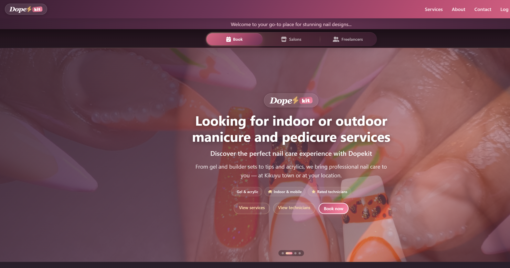
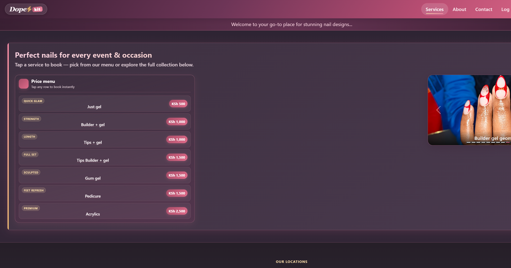
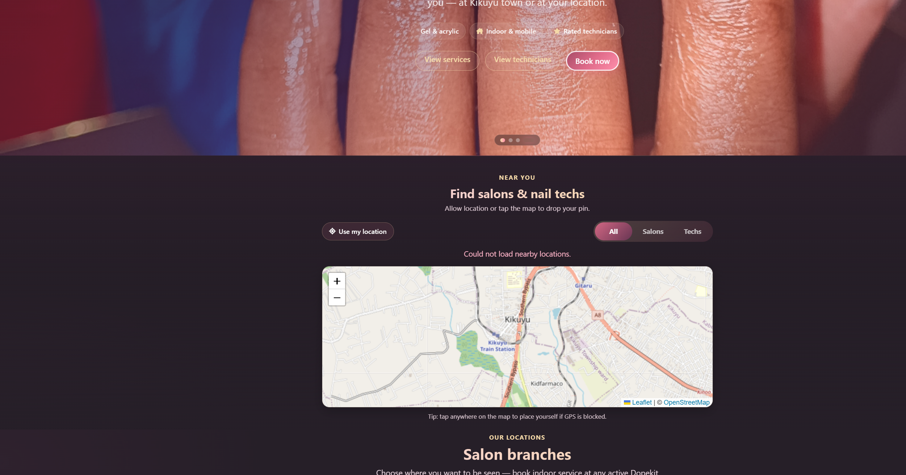
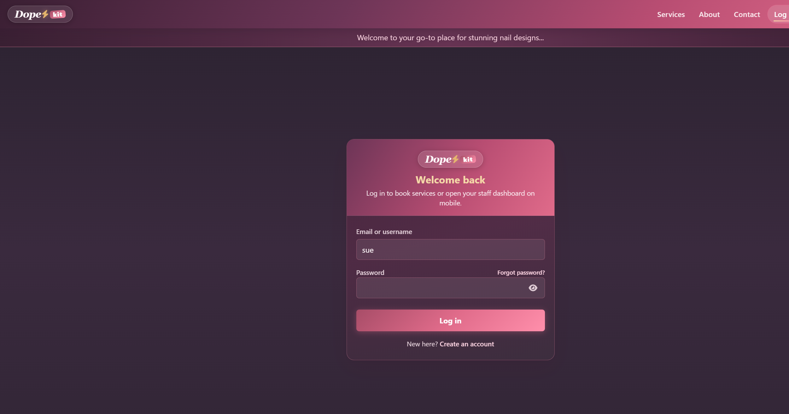
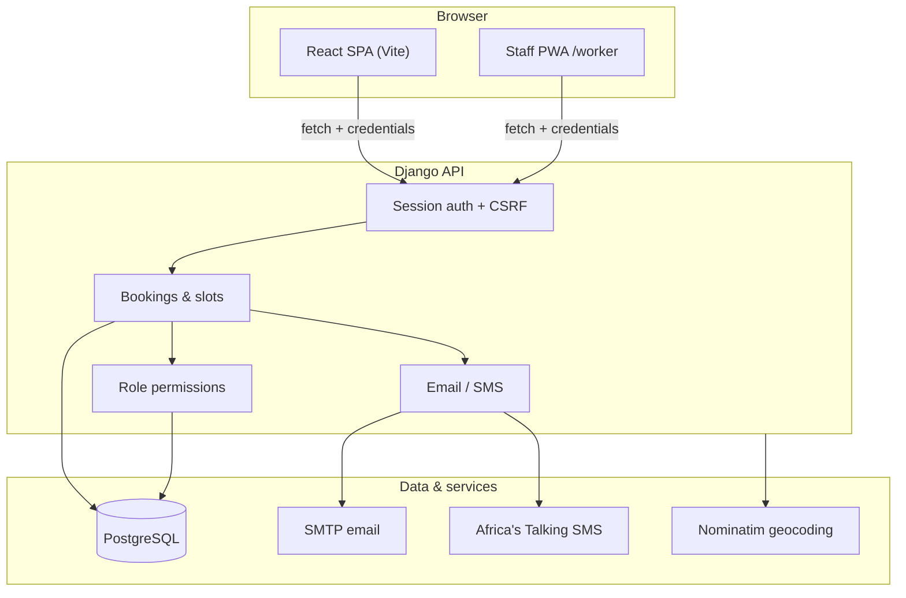

# DopeKit

**Professional nail care booking for Kenya** — indoor salon visits, mobile technicians, multi-branch salons, and staff tools in one platform.

DopeKit replaces messy WhatsApp coordination with real time slots, role-based dashboards, and production-ready deployment configs. Built for salons and freelance nail technicians operating in and around Kikuyu and greater Nairobi.

[](https://github.com/2wicem/Nails-service)
[](https://react.dev/)
[](https://www.djangoproject.com/)
[](https://www.postgresql.org/)

---

## Screenshots

| Landing & discovery | Services & pricing |
|---|---|
|  |  |

| Nearby map | Client & staff login |
|---|---|
|  |  |

> Screenshots captured from the local dev environment. Ensure the Django API is running on port **8000** when testing data-heavy pages.

---

## What DopeKit does

### Clients
- Browse services, pricing (KSh), salon branches, and technicians
- Book **indoor** (at salon) or **outdoor** (mobile visit) appointments
- Pick a **2-hour time slot** or request a preferred technician
- Manage bookings — cancel and reschedule from **My Bookings**
- Password reset via email or SMS OTP

### Technicians (staff PWA)
- Installable **Dopekit Staff** app at `/worker`
- Manage daily schedule, mark off days, accept/cancel bookings
- Browser notifications for new pending requests
- Personal booking reports

### Salon owners
- Create and edit branches, invite codes, social links
- Review salon-team technician applications
- View and assign staff per branch

### Platform admins
- Dashboard stats, walk-in bookings, user/role management
- Approve technicians, manage salons, export reports (CSV)
- Contact message inbox

---

## Architecture

DopeKit is a **decoupled SPA + JSON API**. The React frontend talks to Django over HTTPS with **session cookies** and **CSRF tokens** — not JWT.



### Project structure

```
Nails-service/
├── Frontend/          # React + Vite customer site & staff PWA
│   └── src/
│       ├── components/    # Pages, booking modal, dashboards
│       ├── context/         # Auth provider
│       └── config/api.js    # apiFetch, CSRF, API base URL
├── Backend/           # Django JSON API
│   ├── bootstrap/         # Settings, CORS, cookies, DB config
│   └── products/          # Models, views, notifications, migrations
├── deploy/            # nginx + systemd configs for VPS
├── docs/screenshots/  # README images
└── render.yaml        # Render.com blueprint (API + static site + Postgres)
```

### Core data model

| Entity | Purpose |
|--------|---------|
| `User` + `UserProfile` | Auth, role (client / worker / salon_owner / admin), technician fields |
| `Salon` | Branch details, GPS, owner, per-branch invite code |
| `TimeSlot` | 2-hour blocks per worker (available / booked / unavailable) |
| `Booking` | Appointment — links client, salon, slot, status (pending → accepted) |

---

## Tech stack

| Layer | Technologies |
|-------|----------------|
| **Frontend** | React 18, Vite 5, React Router 6, Bootstrap 5, Leaflet |
| **Staff app** | vite-plugin-pwa (installable at `/worker`) |
| **Backend** | Django 5, Python 3.12+, Gunicorn, WhiteNoise |
| **Database** | PostgreSQL (production), SQLite (optional local dev) |
| **Auth** | Django sessions, CSRF, role-based API guards |
| **Notifications** | SMTP (Gmail), Africa's Talking SMS |
| **Maps** | react-leaflet, OpenStreetMap, Nominatim geocoding |
| **Deploy** | Render, Railway, nginx + systemd (VPS) |

---

## Getting started

### Prerequisites

- [Node.js](https://nodejs.org/) 18+
- [Python](https://www.python.org/) 3.12+
- PostgreSQL *(optional locally — SQLite works for quick dev)*

### 1. Clone the repository

```bash
git clone https://github.com/2wicem/Nails-service.git
cd Nails-service
```

### 2. Backend setup

```bash
cd Backend
python -m venv .venv

# Windows
.venv\Scripts\activate

# macOS / Linux
source .venv/bin/activate

pip install -r requirements.txt
copy .env.example .env        # Windows
# cp .env.example .env        # macOS / Linux
```

Edit `.env` for local development (defaults are fine to start):

```env
DEBUG=True
USE_SQLITE=True
FRONTEND_URL=http://localhost:5173
```

Run migrations and create an admin user:

```bash
python manage.py migrate
python manage.py createsuperuser
python manage.py runserver 0.0.0.0:8000
```

API health check: [http://localhost:8000/products/](http://localhost:8000/products/)

Django admin: [http://localhost:8000/admin/](http://localhost:8000/admin/)

### 3. Frontend setup

In a second terminal:

```bash
cd Frontend
npm install
npm run dev
```

App: [http://localhost:5173/](http://localhost:5173/)

Vite proxies `/api` → `http://127.0.0.1:8000` in development.

### 4. Fresh database (no demo users)

DopeKit does **not** ship demo accounts, fake bookings, or pre-filled salon branches. After migrate, create your admin:

```bash
cd Backend
python manage.py createsuperuser
```

Add salons, technicians, and slots through **Django admin** (`/admin/`), the **owner panel**, or public signup.

To wipe all users, bookings, and salon branches locally:

```bash
python manage.py purge_users --yes --include-salons
```

List salon branches:

```bash
python manage.py list_salons
```

---

## Environment variables

Copy `Backend/.env.example` to `Backend/.env`. Important production values:

| Variable | Description |
|----------|-------------|
| `SECRET_KEY` | Required when `DEBUG=False` |
| `SITE_URL` | Public API URL (e.g. `https://api.dopekit.co.ke`) |
| `FRONTEND_URL` | React app URL (e.g. `https://dopekit.co.ke`) |
| `DATABASE_URL` | PostgreSQL connection string |
| `VITE_API_BASE` | Frontend build-time API URL |
| `EMAIL_HOST_*` | SMTP for booking & password emails |
| `AT_API_KEY` | Africa's Talking SMS |
| `GEOCODING_ENABLED` | Auto lat/lng from address text |

See `.env.example` for the full list including cookie, CORS, and technician signup flags.

---

## API overview

All JSON endpoints live under `/products/`:

| Area | Examples |
|------|----------|
| Auth | `POST /auth/login/`, `GET /auth/me/`, `POST /auth/register/` |
| Public | `GET /salons/`, `GET /workers/`, `GET /slots/`, `GET /map/nearby/` |
| Client | `POST /bookings/`, `GET /bookings/mine/`, cancel & reschedule |
| Worker | `GET /bookings/worker/`, `POST /bookings/:id/accept/`, slot management |
| Owner | `/owner/salons/`, `/owner/applications/` |
| Admin | `/admin/stats/`, `/admin/technicians/pending/`, walk-in bookings |
| Reports | `/reports/summary/`, `/reports/export/` |

Booking requires an authenticated **client** session. Worker and admin routes enforce role checks server-side.

---

## Production deployment

### Render (recommended)

The repo includes `render.yaml` with three resources:

1. **dopekit-api** — Django + Gunicorn + migrations on deploy  
2. **dopekit-web** — static React build  
3. **dopekit-db** — managed PostgreSQL  

Set `SITE_URL`, `FRONTEND_URL`, `VITE_API_BASE`, and email/SMS secrets in the Render dashboard.

### Railway

Step-by-step guide: **[docs/DEPLOY-RAILWAY.md](docs/DEPLOY-RAILWAY.md)**

Three resources: **PostgreSQL** + **Backend** (root dir `Backend/`) + **Frontend** (root dir `Frontend/`). Set `DATABASE_URL`, `SITE_URL`, `FRONTEND_URL`, and `VITE_API_BASE` as documented.

### VPS (nginx + systemd)

See `deploy/nginx/dopekit.conf` and `deploy/systemd/dopekit.service`:

1. Build frontend: `cd Frontend && npm ci && npm run build`
2. Collect static: `cd Backend && python manage.py collectstatic --noinput`
3. Configure nginx to serve `Frontend/dist` and proxy `/products/` to Gunicorn
4. Enable the systemd unit with `EnvironmentFile` pointing to `.env`

### Production checklist

- [ ] `DEBUG=False` and strong `SECRET_KEY`
- [ ] PostgreSQL (not SQLite)
- [ ] `SITE_URL` and `FRONTEND_URL` set correctly
- [ ] HTTPS enabled (`USE_HTTPS=True`)
- [ ] SMTP and SMS credentials configured
- [ ] Run `python manage.py migrate` on deploy

---

## Security highlights

- Session-based auth with HttpOnly cookies and CSRF on mutating requests
- CORS + CSRF trusted origins derived from environment URLs
- IP rate limiting on login, register, password reset, and booking create
- Role and data-scoping checks on every sensitive endpoint
- Technician approval workflow before staff dashboard access
- Admin role not assignable via public signup

---

## Upcoming features

Planned improvements on the roadmap:

- [ ] **Service catalog in the database** — per-salon menus and admin price editor (today pricing is frontend constants)
- [ ] **Client-submitted reviews** — ratings currently admin-managed on technician profiles
- [ ] **Online payments** — M-Pesa integration for deposits or prepayment
- [ ] **Background job queue** — async notifications, geocoding, and report generation (Celery + Redis)
- [ ] **Geo-optimized search** — PostGIS bounding-box queries instead of loading all markers
- [ ] **Real-time worker alerts** — WebSockets or push instead of polling
- [ ] **Automated API test suite** — permission boundaries and booking concurrency tests
- [ ] **Error monitoring** — Sentry or similar for production observability

---

## Contributing

This is an active portfolio / product codebase. If you are contributing:

1. Fork the repository
2. Create a feature branch
3. Keep commits focused and descriptive
4. Open a pull request with a clear summary and test plan

---

## License

All rights reserved unless otherwise specified by the repository owner.

---

## Contact

- **Email:** dopekit@gmail.com  
- **Phone:** +254 790 331 108  
- **Location:** Kikuyu Town, Kenya  
- **GitHub:** [github.com/2wicem/Nails-service](https://github.com/2wicem/Nails-service)
